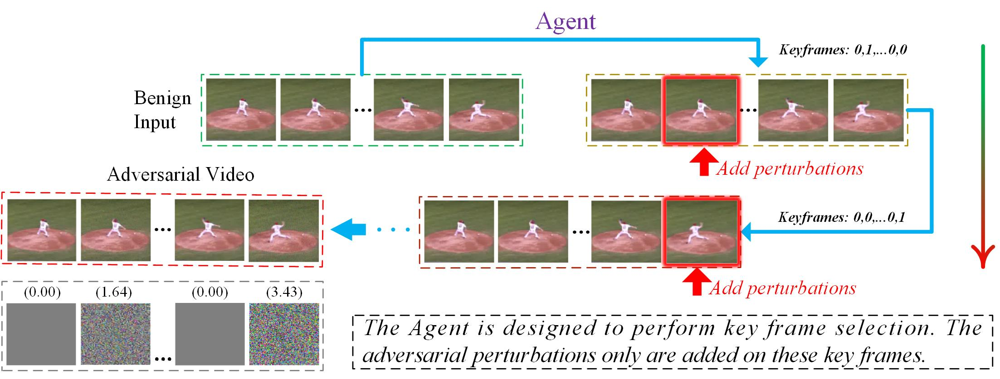

# EARL

This repository provides a simple implementation of the work [“Efficient Sparse Attacks on Videos using Reinforcement Learning”](https://dl.acm.org/doi/abs/10.1145/3474085.3475395)

**Example:**



**Demo:**

Here, we provide 5 video clips in folder "dataset_numpy", you can run the following script and observe the effect:

```python
python un_attack_show.py   # untargeted attack
```

or

```python
python T_attack_show.py    # targeted attack
```

**Threat models:**

The video classification model, please refer to project https://github.com/FenHua/action-recognition

You can train the recognition model with your own data, and use the video attack method to attack them.

**Please cite:**

```
@inproceedings{yan2021efficient,
  title={Efficient Sparse Attacks on Videos using Reinforcement Learning},
  author={Yan, Huanqian and Wei, Xingxing},
  booktitle={Proceedings of the 29th ACM International Conference on Multimedia},
  pages={2326--2334},
  year={2021}
}
```

